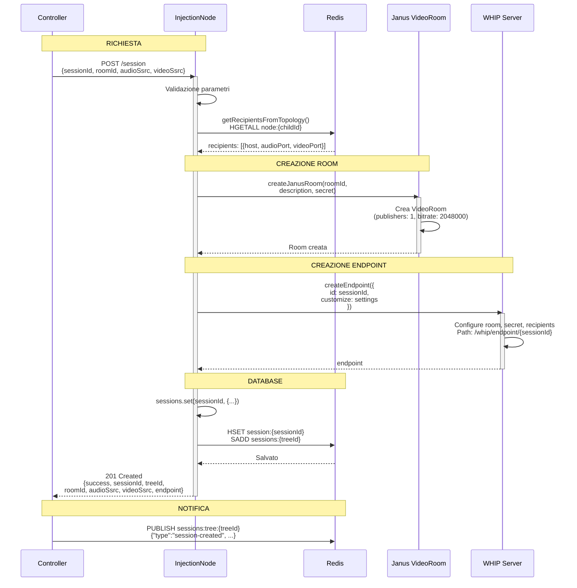

```mermaid
sequenceDiagram
    participant Controller as Controller
    participant InjectionNode as InjectionNode
    participant Redis as Redis
    participant Janus as Janus VideoRoom
    participant WHIP as WHIP Server

    Note over Controller,InjectionNode: RICHIESTA
    Controller->>InjectionNode: POST /session<br/>{sessionId, roomId, audioSsrc, videoSsrc}
    
    activate InjectionNode
    InjectionNode->>InjectionNode: Validazione parametri
    InjectionNode->>Redis: getRecipientsFromTopology()<br/>HGETALL node:{childId}
    Redis-->>InjectionNode: recipients: [{host, audioPort, videoPort}]
    
    Note over InjectionNode,Janus: CREAZIONE ROOM
    InjectionNode->>Janus: createJanusRoom(roomId,<br/>description, secret)
    activate Janus
    Janus->>Janus: Crea VideoRoom<br/>(publishers: 1, bitrate: 2048000)
    Janus-->>InjectionNode: Room creata
    deactivate Janus
    
    Note over InjectionNode,WHIP: CREAZIONE ENDPOINT
    InjectionNode->>WHIP: createEndpoint({<br/>  id: sessionId,<br/>  customize: settings<br/>})
    activate WHIP
    WHIP->>WHIP: Configure room, secret, recipients<br/>Path: /whip/endpoint/{sessionId}
    WHIP-->>InjectionNode: endpoint
    deactivate WHIP
    
    Note over InjectionNode,Redis: DATABASE
    InjectionNode->>InjectionNode: sessions.set(sessionId, {...})
    InjectionNode->>Redis: HSET session:{sessionId}<br/>SADD sessions:{treeId}
    Redis-->>InjectionNode: Salvato
    
    InjectionNode-->>Controller: 201 Created<br/>{success, sessionId, treeId,<br/>roomId, audioSsrc, videoSsrc, endpoint}
    deactivate InjectionNode
    
    Note over Controller,Redis: NOTIFICA
    Controller->>Redis: PUBLISH sessions:tree:{treeId}<br/>{"type":"session-created", ...}
```