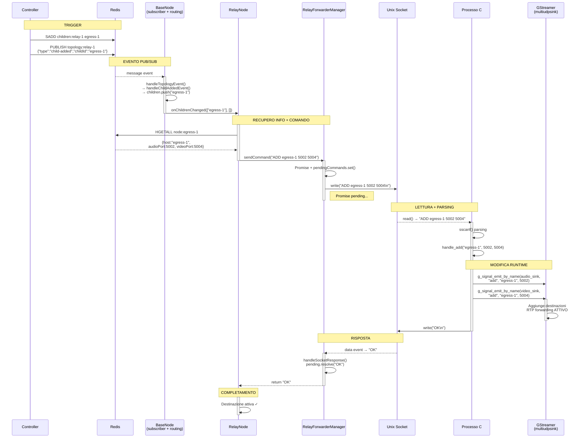

```mermaid
sequenceDiagram
    participant Controller as Controller
    participant Redis as Redis
    participant BaseNode as BaseNode<br/>(subscriber + routing)
    participant RelayNode as RelayNode
    participant Manager as RelayForwarderManager
    participant Socket as Unix Socket
    participant ProcessC as Processo C
    participant GStreamer as GStreamer<br/>(multiudpsink)

    Note over Controller,Redis: TRIGGER
    Controller->>Redis: SADD children:relay-1 egress-1
    Controller->>Redis: PUBLISH topology:relay-1<br/>{"type":"child-added","childId":"egress-1"}
    
    Note over Redis,BaseNode: EVENTO PUB/SUB
    Redis-->>BaseNode: message event
    activate BaseNode
    BaseNode->>BaseNode: handleTopologyEvent()<br/>→ handleChildAddedEvent()<br/>→ children.push("egress-1")
    BaseNode->>RelayNode: onChildrenChanged(["egress-1"], [])
    deactivate BaseNode
    
    Note over RelayNode,Manager: RECUPERO INFO + COMANDO
    activate RelayNode
    RelayNode->>Redis: HGETALL node:egress-1
    Redis-->>RelayNode: {host:"egress-1",<br/>audioPort:5002, videoPort:5004}
    RelayNode->>Manager: sendCommand("ADD egress-1 5002 5004")
    deactivate RelayNode
    
    activate Manager
    Manager->>Manager: Promise + pendingCommands.set()
    Manager->>Socket: write("ADD egress-1 5002 5004\n")
    Note right of Manager: Promise pending...
    deactivate Manager
    
    Note over Socket,ProcessC: LETTURA + PARSING
    Socket-->>ProcessC: read() → "ADD egress-1 5002 5004"
    activate ProcessC
    ProcessC->>ProcessC: sscanf() parsing
    ProcessC->>ProcessC: handle_add("egress-1", 5002, 5004)
    
    Note over ProcessC,GStreamer: MODIFICA RUNTIME
    ProcessC->>GStreamer: g_signal_emit_by_name(audio_sink,<br/>"add", "egress-1", 5002)
    ProcessC->>GStreamer: g_signal_emit_by_name(video_sink,<br/>"add", "egress-1", 5004)
    activate GStreamer
    GStreamer->>GStreamer: Aggiunge destinazioni<br/>RTP forwarding ATTIVO
    deactivate GStreamer
    
    ProcessC->>Socket: write("OK\n")
    deactivate ProcessC
    
    Note over Socket,Manager: RISPOSTA
    Socket-->>Manager: data event → "OK"
    activate Manager
    Manager->>Manager: handleSocketResponse()<br/>pending.resolve("OK")
    Manager-->>RelayNode: return "OK"
    deactivate Manager
    
    Note over RelayNode: COMPLETAMENTO
    activate RelayNode
    RelayNode->>RelayNode: Destinazione attiva ✓
    deactivate RelayNode
```